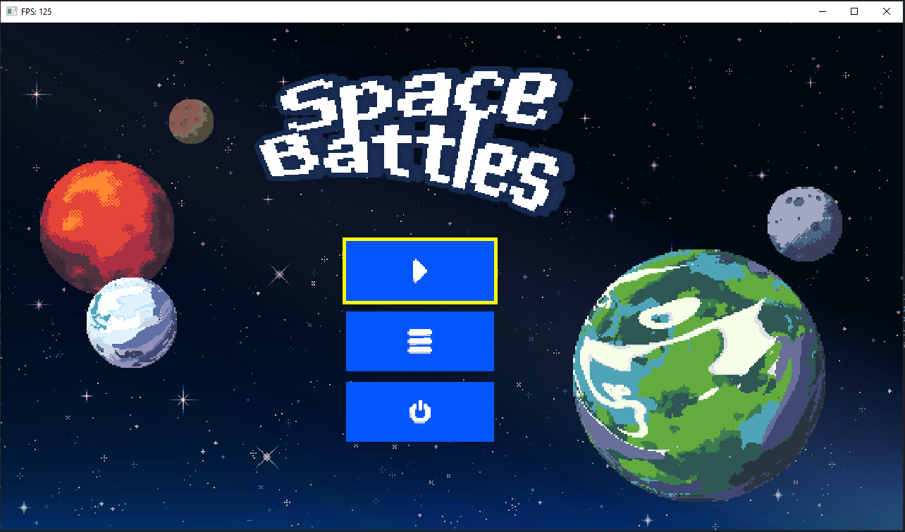
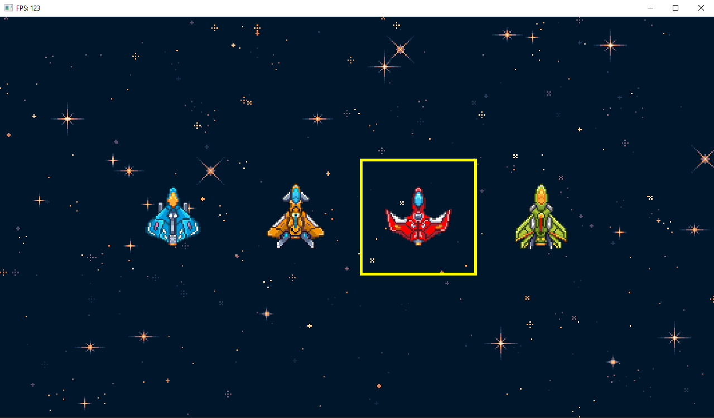
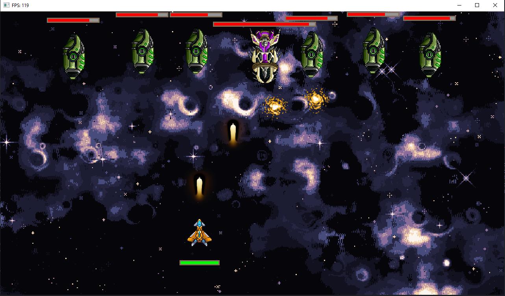

# 🧑‍🚀 SpaceBattlesGame educational project

University project of OOP subject. Project divided into two modules:
**engine** — fundamental classes, which forms game;
**game** — gameplay module with scenes and game objects.

### Screenshots of game

#### Animated main menu

#### Base game mechanics

#### Visual and sounds effects implemented

